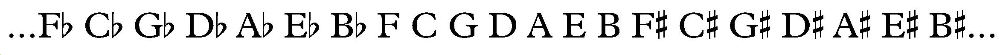

When you're writing in a single key for an extended period of time, it gets tedious to write out the accidentals over and over again. 

Here is a simple melody in D major, without a key signature. 

To avoid this, composers used *key signatures* at the beginning of each staff to remind performers of which pitch classes should have flats or sharps. 

Here is the same melody, with the key signature at the beginning of the staff to remind the performer that F and C should be sharp. 

### The circle of fifths

The circle of fifths is an illustration that has been used in music theory pedagogy for hundreds of years. It conveniently summarizes the key signature needed for any key with up to seven flats or sharps. 

### The line of fifths

But *which* notes are flat or sharp in a key? To properly use the circle of fifths to figure out a key signature, think of it, instead as an infinite spiral, or as a line that extends infinitely in both directions.  For practicality, write it out, like so:

To determine what accidentals to use in the signature for a major key, block off seven notes, beginning with one note to the left of the desired key.  For example, C major uses the seven notes without accidentals in the middle of our line:

Note the following properties:
<ul>
  <li> We have placed the major key tonic note in the second position.
  <li> The major triads are in the 1st, 2nd, and 3rd positions.
  <li> The minor triads are in the 3rd, 4th, and 5th positions.
  <li> The leading tone is in the 7th position.
</ul>

These properties hold true for any block of seven consecutive notes.  We can test this by trying another key signature for a major key.  D major, for example, is readily determined by boxing seven notes, from one position left of D (G), like so:

Notice that we have included two new accidentals, F# and C#, which are needed for the key signature of D major.  Notice also that all the properties listed above are still true (e.g., C# is in the seventh position, and is the seventh note in the scale, or, as we say,  the leading tone). 

Now let's try a less common key, F# major.  The box of seven notes starts at B, like so:

Notice that we will need six sharps in our key signature.  As an aside, notice that the leading tone in the 7th position is E#, NOT F.  The consistent set of properties among the seven notes indicates the clearest reason why F would be a "misspelled" note in F# major.  F and E# are enharmonically the same, but they are not <i>functionally</i> the same.  It is similar to misspelling words (e.g., "royal" as "roil"): they sound the same, but have different meanings.

### Minor key signatures ###

Of course, minor keys can use key signatures, too. In fact, for each major key signature, there is a corresponding minor key that shares its signature. Major and minor keys that share the same key signature are called *relative* keys. For example, both C major and A minor have zero sharps or flats. A minor is considered the *relative minor* of C major; likewise, C major is considered the *relative major* of A minor. Using the line of fifths to determine key signatures for minor keys works in much the same way as before, except that the tonic of the minor key is in the <b>5th</b> position in the box. To find the key signature for G minor, for example, place a box around seven notes, with G in the 5th position, like so:

The box of seven notes includes Bb, and Eb, which is exactly what is needed in the key signature for G minor (and its relative major, Bb).

### Writing key signatures ###

Below is a reference that shows how all of the key signatures should be written on treble, alto, tenor, and bass clefs. 

